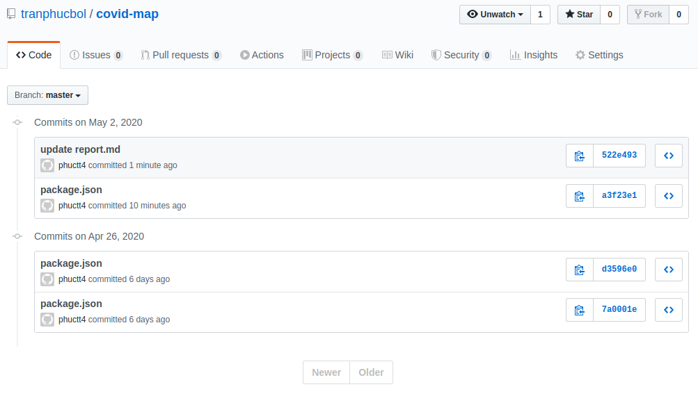

# Report

## Requirement

- Use React router to add two url /map and /stats to switch between Map and Stats component as two attachments below: 2 points.
- When navigate to /map display and ensure features implemented in BTCN04 working correctly: 2 points.
- When navigate to /stats display two line charts about COVID-19 statistics of Vietnam and the World from Dec 08'19 to the current date: 4 points.
- Upload your project to public host: 1 points.
- Use git to track and mange your mid-term working, capture your commit history as proof: 1 points

## Completed

- Use React router to add two url /map and /stats to switch between Map and Stats component as two attachments below: 2 points.
- When navigate to /map display and ensure features implemented in BTCN04 working correctly: 2 points.
- When navigate to /stats display two line charts about COVID-19 statistics of Vietnam and the World from Dec 08'19 to the current date: 4 points.
- Upload your project to public host: 1 points.
- Use git to track and mange your mid-term working, capture your commit history as proof: 1 points

## Git History

    

